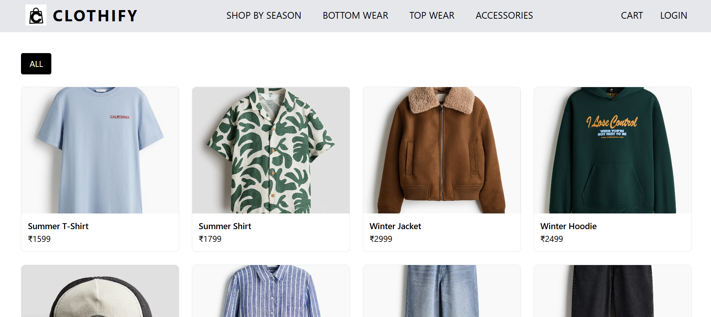
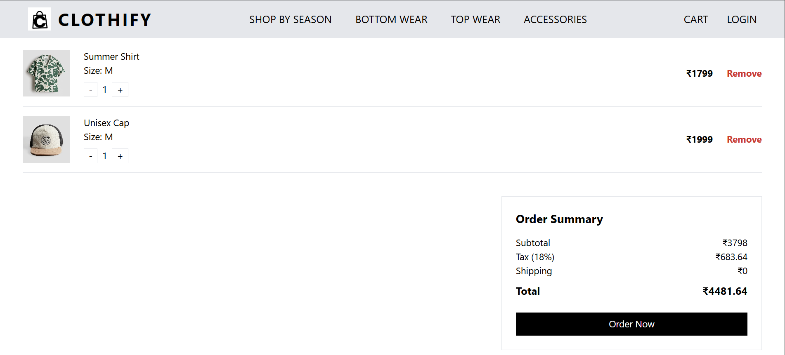
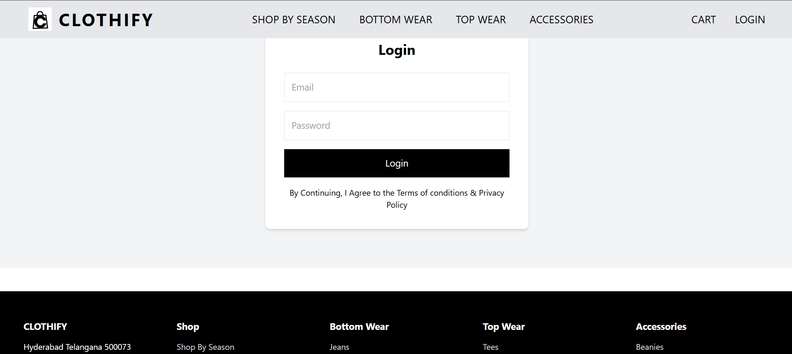
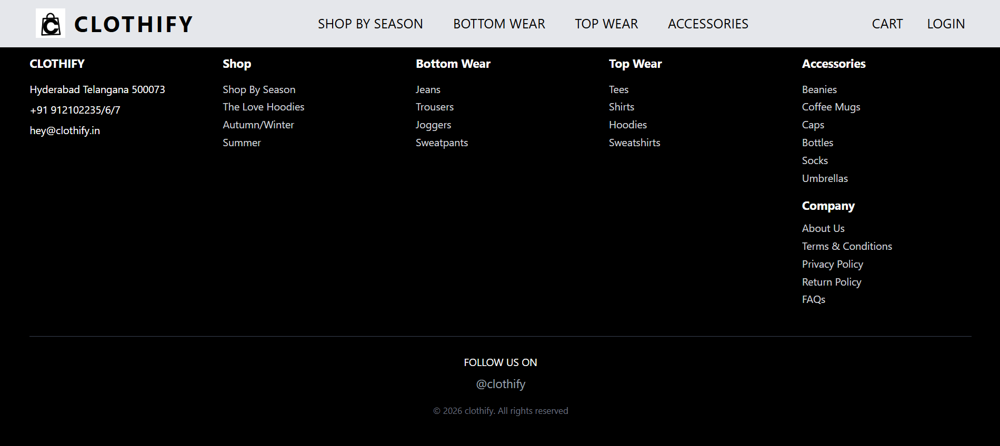

# 🛍️ Clothify - E-commerce Web App

A modern clothing e-commerce website built using React, Vite, and Tailwind CSS.

---

## 🏠 Home Page


---

## 🛍️ Collections Page



---

## 📦 Product Details Page


---

## 🛒 Cart Page



---

## 🔐 Login Page



---

## 🧾 Footer Section



---

## 🚀 Features

- Product browsing & filtering
- Add to cart functionality (LocalStorage)
- Cart with subtotal, tax & total
- Product details page
- Login page (dummy authentication)
- Responsive UI

---

## 🧑‍💻 Tech Stack

- React JS
- Vite
- Tailwind CSS
- React Router DOM
- LocalStorage

---

## 📦 Run Project

```bash
npm install
npm run dev